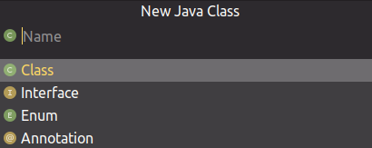
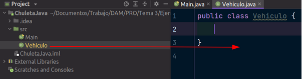
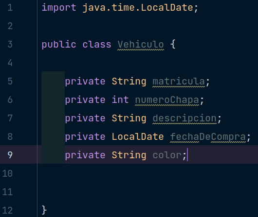
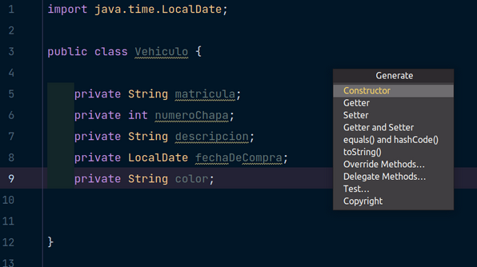
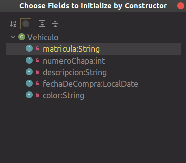
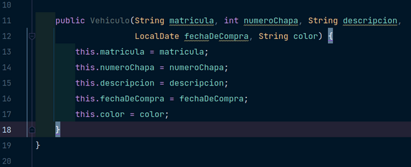
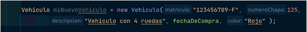
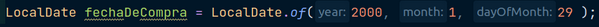

### Objetos:

``` diff
- Para esta actividad se ha importado la clase LocalDate.
```

Hasta ahora, hemos utilizado variables que no contienen si no un único valor, el cual puede ser alterado a medida que se va nombrando en el código, como en el siguiente ejemplo:
<br/>

> String nombre = “Moisés”; 
> 
> nombre = “Luis”;

<br/>
En el primer momento en el veamos la variable nombre tendrá el valor “Moisés”, y tras alterar su contenido podremos ver “Luis”. Esto es al menos lo que hemos visto hasta ahora, y ocurre con todos los elementos; se define un tipo de dato, seguido de un nombre y una igualación con el contenido que va a residir dentro.

A su vez, no podemos alterar este dato, es decir; no podemos hacer que nombre tenga un valor flotante por ejemplo.

Pues, existe un tipo de elemento que se denomina Objeto, (Object en inglés) estos elementos son un grupo de atributos que forman algo, es decir; si tuviéramos que representar de manera real un elemento físico de nuestro dia a dia (un portátil por ejemplo), podríamos sacar características que lo definen tales como:

- Tamaño
- Fabricante
- Modelo
- Velocidad

Estos elementos son elementos que cualquier persona que hable castellano de manera promedia a primeras ya entiende, e intenta recrearlas en su cabeza. Pues los objetos funcionan de una manera parecida; si nosotros nos fijamos, antes para poder definir a una persona hacíamos lo siguiente:
<br/>

> 
> String alumno1Nombre = “Moisés Fernández Muiña”;
> 
> int alumno1Edad = 21;
> 
> String alumno1Clase = “1ºDAM”;
> 

<br/>
Pero, si nos damos cuenta, estas variables no tienen ninguna relación entre sí; es verdad que los nombres se refieren a un “alumno1” seguido de lo que DEBERÍA residir dentro de estas variables, ya que yo podría escribir en alumno1Nombre el nombre de mi plato favorito y el valor como tal no cumple con el nombre de la variable (ya que debería ser el de un alumno) pero sí con el tipo de dato String (porque es una cadena); y a su vez es un tostón tener que crear 3 variables cada vez que queremos crear un nuevo usuario, y luego vara ver los datos de cada uno ni te cuento. 

Es por ello que existen los objetos, que vendría a ser lo ya mencionado anteriormente, una agrupación de atributos que forma algo en concreto: una entidad. Para crear un objeto deberemos hacer lo siguiente:

1. Deberemos crear un archivo de extensión .java, si estamos en IntelliJ IDEA podremos crearlo haciendo click derecho en src y dándole a New > Java Class; una vez le demos nos saldrá la siguiente ventana: 

<center>



</center>

2. Le pondremos un nombre y nos deberá crear algo como lo siguiente:

<center>



</center>


Ya tenemos nuestro objeto casi listo, ahora nos queda entrar en él para poner las cosas que deberían ir dentro.

3. Para poder abrirlo haremos lo de siempre, arrastrarlo hasta la zona de edición o bien dándole doble click izquierdo. Una vez dentro, deberemos asignar ciertos parámetros que son los que estructuran un Objeto; estos parámetros son:

- Atributos o Campos: Cualidades que definen a su objeto como puede darse a intuir. Estas cualidades son variables (normalmente) con un tipo de dato y con un nivel de seguridad asignado (esto último se comentará más adelante de todas formas).
- Constructor: Este elemento es una función que se encarga de utilizar los atributos anteriormente mencionados para crear un objeto. Un objeto puede tener varios constructores ya que según qué objeto queramos crear quizá no queramos pedir siempre todos los atributos al usuario. Esto siempre se ve mejor con ejemplos y a su vez haciéndolo.

Esto es al menos lo mínimo que tenemos que saber ahora (repito que todo esto es la teoría, la práctica vendrá toda ahora).

En primer lugar crearemos los atributos para el objeto que tenemos, normalmente al tratarse de objetos suelen ser elementos tangibles o descriptibles de la vida real, por eso yo he escogido de nombre vehículo; en caso que hayas puesto “Objeto” como nombre no pasa nada, tendrás que renombrarlo (refactorizando) y poner algún elemento que te sea familiar:

Los atributos que he escogido para Vehículo son:

<center>



</center>

Estos datos sirven para recoger cualquier vehículo que existe de una manera genérica. Si quisiéramos hacer un objeto para únicamente coches deportivos, los atributos son diferentes ya que un deportivo no se define solo por lo que hemos puesto, también por el número de ventanas, el número de puertas, velocidad máxima…

Por otro lado, de momento pondremos private delante de nuestros atributos en todo momento, ya que como veremos en la siguiente sección, existen varias optativas más (que son los niveles de seguridad que se mencionó con anterioridad).

Para crear un constructor tenemos dos formas:

- La manera rápida: utilizando una de las macros de nuestro editor (en este caso es IntelliJ IDEA), podemos crearlo con solo un click y seleccionando unas opciones.
- La manera clásica: escribiendo a mano.

Evidentemente si tenéis la posibilidad de usar la manera rápida no dudéis. Pero más adelante veremos ejemplos en los que la estructura del constructor quizá no la queramos así para ciertas situaciones. 

La macro que existe para IntelliJ (en Windows y Linux es la misma, en Mac es donde varía) es **Alt + Insert** (en caso de usar un portátil quizá tendremos que usar **Alt + Fn + Insert**) y en caso de Mac deberia ser **Comando + N**.

Una vez le demos correctamente a las teclas nos saldrá la siguiente mini-ventana:

<center>



</center>

Aquí es donde tenemos el constructor además de otros elementos que de momento no vamos a entrar en detalle, pero lo haremos más adelante. Seleccionaremos lo que hemos venido a buscar, constructor en este caso, y al abrirse nos saldrá otra ventana con los atributos que hemos creado con anterioridad:

<center>



</center>

En esta última pestaña es donde seleccionaremos los elementos que queramos que formen parte de nuestro constructor, como en este caso los queremos todos los seleccionaremos a la vez (podemos hacerlo dando Click mientras mantenemos la tecla Ctrl pulsada). Una vez le demos a continuar nos creará dicho constructor:

<center>



</center>

Pero claro, ¿para qué sirve esto?, sencillamente de momento no hace absolutamente nada, tenemos que declararlo primero (es decir, llamarlo en el main y “crear nuestro primer vehículo”), para ello nos iremos al main y lo crearemos:

Y tenemos que escribir lo siguiente:

> Vehiculo miNuevoVehiculo = new Vehiculo("123456789-F", 125, "Vehículo con 4 ruedas", fechaDe Compra, "Rojo" );


1. Nombre del objeto: Este es el nombre del elemento que acabamos de crear, en mi caso es *Vehículo*.
2. Nombre de la variable: Como ocurría con el Scanner; para pedir al usuario una entrada de teclado estábamos utilizando un objeto durante todo momento, al que llamábamos *“teclado”* o *“userInput”*, pues aquí en este caso lo llamaremos miNuevoVehiculo.
3. Instanciación del objeto: Lo mismo que hacíamos con el Scanner, instanciamos el objeto poniendo new + NombreDelObjeto, en este caso es *new Vehiculo*, el truco está en que este último valor es exactamente el mismo que el primero, por lo que no tiene pérdida alguna.
4. Adición de parámetros: Esto que ponemos entre paréntesis son los valores que tenemos en el constructor, si nos fijamos en la imagen de antes, tenemos que primero el usuario tiene que meter un valor String que se llama “matricula”, seguido iría un valor Int llamado “numeroChapa” junto al orden que podemos seguir viendo tras de este.

De ahí que nuestro resultado sea algo como esto.

<center>



</center>

El IntelliJ nos facilita este trabajo muchas veces poniéndonos que va en cada posición, repito que esto es el nombre del atributo (o campo como se quiera llamar) que nosotros pusimos en el objeto y posteriormente en el constructor.

Por cierto la variable *fechaDeCompra* al tratarse de un tipo de dato LocalDate, tendremos que declararla fuera para luego llamarla ya creada:

<center>



</center>

