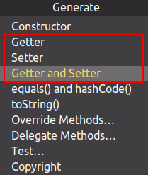
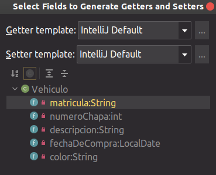
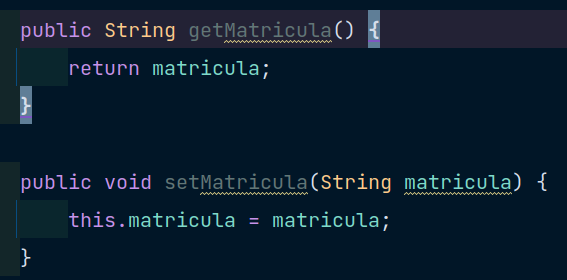
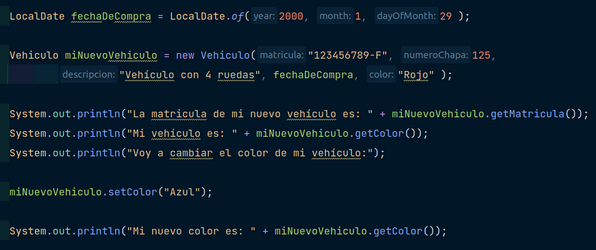
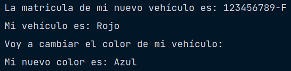

## Objetos - Los métodos de acceso

 

Los métodos de acceso son principalmente funciones que permiten interactuar con los atributos de los objetos que tenemos. Por si no lo sabes todavía, una función es un bloque de código que se crea para poder ser ejecutado múltiples veces cada vez que se le llama (por llamar me refiero a escribir su nombre haciendo referencia, como cuando pones un índice y al hacer click a un título vas a esa página con ese título y el contenido de ese título, es como hicimos en el ejemplo anterior para crear un vehículo).

Es por ello que el código que nosotros solemos utilizar para por ejemplo mostrar una cadena de texto y que de esta, la primera palabra sea la única en mayúscula lo podríamos hacer en una función. Pero dejemos de meternos en otros temas porque aquí hemos venido a hablar de ***MÉTODOS DE ACCESO***; pues como bien mencioné al inicio de este apartado, un método de acceso es aquel que se encarga de obtener y devolver o modificar un atributo (si, solo puede hacer una de las dos: obtener dicho valor o modificarlo, no puede ni mostrar por pantalla, ni poner la primera letra en mayúscula).

Estos métodos de acceso son lo que básicamente nos devuelve todo lo que queramos de él o los objetos que hayamos creado, por lo que al tener esta frase ya en mente podemos concluir que, si quisiéramos ver la matrícula del vehículo creado en la actividad anterior deberemos tener un método de acceso que nos devuelve dicho valor desde el objeto.

Vale, si, lo se mucho parloteo pero poco tecleo, vamos a mostrar que son estos métodos en el código.

Para los más curiosos, es posible que en el menú que abrimos con anterioridad para crear nuestro constructor os fijasteis que existen 3 elementos que se llaman *“Getter”*, *“Setter”* y otro con ambos.

 

Las dos primeras opciones y la tercera hacen exactamente lo mismo, la diferencia es que la primera solo nos crea los métodos que devuelven datos y la segunda solo los que cambian o alteran dichos datos, la última es un mix.

Pues bien, lo que vamos a hacer es seleccionar la tercera. Y nos aparecerá una ventana bastante familiar.

 

 

Aquí sencillamente seleccionaremos los atributos de los que queramos crear tanto getters (métodos de acceso) o setters (métodos de alteración), honestamente no se como se llaman, ni siquiera se si tienen un nombre establecido, pero estos funcionarán de momento.

Ahora como veremos se nos habrán creado 10 nuevas funciones, (muy pequeñitas) que tienen delante *“get”* o *“set”* + *Nombre del Atributo*.

 

 

Básicamente deberemos fijarnos en qué tipo de funciones son (más adelante si no lo he hecho ya, añadiré un tema para los tipos de funciones y cómo diferenciarlas) pero por lo que se puede ver en la imagen anterior, la primera función: getMatricula() nos devuelve un String, y la segunda función: setMatricula() no devuelve nada, si no que nos altera el atributo matricula. Si nos fijamos todos los métodos son iguales (cambiando los atributos de los que habla claro).

Ahora para usarlos, necesitaremos el objeto que habíamos creado en el apartado anterior, y sencillamente haremos algo como esto:

 

 

Como se puede ver, utilizamos un “getMatricula” sobre nuestro objeto nuevoVehiculo.getMatricula() para conseguir el String que hemos introducido anteriormente. Posteriormente miramos el color que hemos asignado y lo cambiamos para volvera  mostrarlo, este es el resultado:

 

 

Por lo que podemos concluir que estos métodos de acceso son necesarios para alterar y obtener elementos dentro de los objetos que creamos.

[:arrow_backward: Anterior punto](7%20-%20Objetos%20en%20Java.md)  