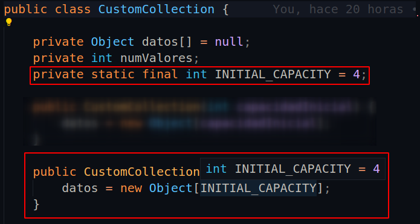
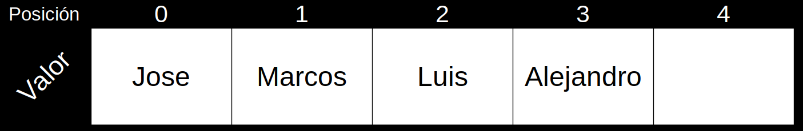
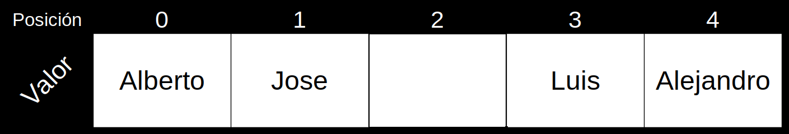
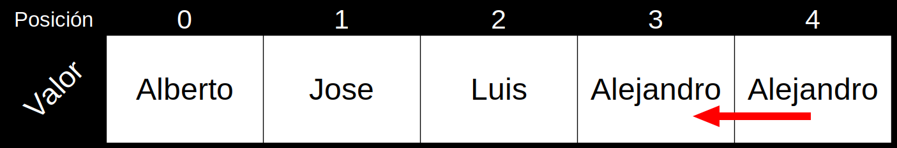

# Colecciones

A la hora de almacenar elementos o cualquier objeto en un Array, nos hemos encontrado con un impedimento bastante curioso (al menos en Java) y es que los Arrays **son fijos** y no puede aumentarse su tamaño para así añadir más información en caso de requerirse.

Es por ello, que algún loco tuvo la idea de crear una especie de Arrays inteligentes, pero más que inteligentes deberíamos denominarlos como **dinamicos**.

Para poder crear un Array dinámico deberemos saber primero como funciona:

Nuestra Coleccion va a ser un Objeto, como los que vimos anteriormente; dicho objeto tendrá sus atributos, constructor y métodos. Vamos a ir de uno en uno viendo cada una de sus partes.

###### La estructura del objeto Collection

El nombre que va a tener nuestro objeto será Array, también llamado *"CustomCollection"* (ya que cumple con la normativa de nombres que pudimos ver con anterioridad), este objeto tendrá varios métodos y atributos, además de su propio constructor.
El nombre que va a tener nuestro objeto será *"CustomCollection"* (ya que cumple con la normativa de nombres que pudimos ver con anterioridad), este objeto tendrá varios métodos y atributos, además de su propio constructor.

Definiremos dos atributos:
- El atributo **datos[ ]** o **data[ ]**, el cual será un Array que se encargará de almacenar la información que queremos almacenar en nuestro objeto CustomCollection. Este Array almacenará **OBJETOS**, ya que como pudimos ver en el anterior apartado, **todos los objetos, heredan del objeto Object**, haciendo asi que todos los valores que utilizaremos (String, Integer, Float, Objetos creados por nosotros...) se podrán almacenar aquí. Dicho Array lo declararemos como ***nulo***. 
- El atributo **numValores** o **numOfValues**, que se encargará de decirnos cuantos valores tenemos dentro de nuestra CustomCollection. **¡OJO!**, este atributo cuenta los elementos que hayamos introducido, es decir, cuantos elementos hay dentro del array, **no el tamaño de este**.

***Ambos atributos serán privados***; Declararemos ambos atributos como en la siguiente imagen:

Una vez los tenemos, tenemos que declarar un constructor para nuestra colección, el cual recibirá como parámetro un valor que nos dirá el usuario. Deberemos preguntar por una capacidad inicial, para que se cree el primer Array en el que se basará nuestra clase.

- El atributo que pasaremos es **capacidadInicial** o **initialCapacity**, esta variable que nos proporcionará el usuario, se encargará de decirnos con cuantos espacios queremos que se cree el Array una vez sea creada la colección.
- Tras de esto, el constructor tiene dentro una instanciación (es decir, está llamando a un Array de tipo Object), en el que ponemos como capacidad el valor que nos dice el usuario. 

También podemos crear un constructor que no reciba ningún parámetro, pero que cree un array con un tamaño que le pongamos nostros internamente, sin que el usuario lo sepa. Miremos el ejemplo:

He tapado el constructor que teniamos antes para que no hubiese confusión, pero igualmente podemos dejar ambos. Si queremos utilizar uno sencillamente pondremos una capacidad o bien podemos omitir este valor y dejar que nuestra clase cree la capacidad por si misma. 

Con esto ya tenemos el 20 % de nuestra clase hecha, ahora nos quedan los métodos con los que haremos que nuestra clase deje de ser un triste Array que no puede auto-extenderse y haremos que sea un Array dinámico. Los métodos que necesitaremos son los siguientes:

- Un método **insert( )**, que recibirá un parámetro de tipo Object (ya que como bien comentamos antes, lo hacemos para que podamos pasar el valor que queramos) y se encargará de introducir un valor en una posición del Array, pero con dos condiciones:
  - **Primera condición**: en caso de querer insertar un valor, en una posición en la que ya existe un valor, dicho valor no remplazará al ya existente sino que en su lugar los valores se rodarán para dejarle hueco al nuevo valor.
  - **Segunda condición**: en caso de que el Array esté lleno, es decir que el número de Objetos que se encuentran dentro sea igual al tamaño total de dicho Array; se deberá hacer más grande, es decir, deberemos hacer que se extienda más para que dicho valor pueda ser introducido.

Por otro, nuestro Array no trabajará con "espacios en blanco" entre los valores, es decir no podemos en un Array de 10 valores, un primer valor en la posición 0 y un segundo valor en la posición 5, ya que habrían 4 espacios entre medias. Esto más adelante lo solucionaremos, pero de momento lo tendremos así.

En caso de tener dudas vamos a ver un ejemplo sencillo.

> He creado un Array con un total de 5 posiciones, en dicho Array ya tengo 4 valores y quiero meter un décimo en la primera posición del Array (es decir, en la posición 0), pero claro ya tengo un valor en dicha posición ¿Cómo deberia de quedar mi Array en caso de yo poner mi valor?.

Imaginemos, que en el Array hay una serie de nombres (como bien indica deberían ser 4 nombres):

Y nosotros queremos hacer esto:

¿Qué es lo que ha pasado?, pues simple; los datos se han rodado de posición para poder dejar espacio al valor *"Alberto"*. Haciendo que el movimiento final sea algo como esto:

Esto es lo que deberá hacer nuestro método **insert ( )**. Pero claro, para hacer esto ***necesitará dos parámetros***, el parámetro que identificará al valor y otro que nos dirá en qué posición queremos que vaya; quedandonos así el método:

    insert(Object elemento, int posicion);

Evidentemente, al añadir una posición más deberemos sumar uno a nuestro número de valores.

- Se necesitará también un segundo método llamado **delete( )**, que se encargará de eliminar un valor según una posición que será proporcionada por el usuario. Como en el caso anterior, tenemos que cumplir una condicion:
  - **Condición**: en caso de que borremos un dato, que tenga datos a su alrededor, tendremos hacer que el hueco sea rellenado por los datos que se encuentran detrás de la posición del dato que hemos borrado.

Pongamos de nuevo el Array que teniamos antes, justo cuando habiamos añadido el nombre de *Alberto*; imaginemos que queremos borrar al usuario Marcos:

Si lo borramos como hemos hecho hasta ahora (que realmente no se puede borrar, si no que sencillamente se pone en *"null"*), debería de quedarnos el Array algo así:

Pero **no es esto lo que nos piden**, o al menos no es lo único, si no que queremos que los datos que hayan a la derecha pasen a este nuevo lugar. Pero claro, si nosotros en lugar de borrar directamente el dato, utilizasemos el valor que viene después, en este caso *Luis*, para escachar a *Marcos* (no escacheis a la gente pls) estariamos también borrando el dato ¿verdad?, realmente remplazandolo pero sería lo mismo conceptualmente:

Entonces, si después de Luis viene alejandro, el resultado final debería ser algo así:

Pero claro, ahora nos queda un valor repetido que no queremos, pero si nos damos cuenta, el número de Valores que teniamos nosotros es 5 (antes de que borrasemos a marcos), pero el Array no lee las posiciones como las hacemos nosotros, si no que en su lugar **le resta un valor, ya que empieza en 0**. Pues utilizando el atributo del número de valores, podemos borrar el valor repetido de la última posición, poniendo un null en su lugar, con una instrucción tan fácil como la siguiente:

    datos[numValores - 1] = null;

Con esto, borraremos el dato *Alejandro* repetido de la última posición de nuestro Array. A su vez, como ocurría con insert que añadiamos un dato y tendría que sumarse un valor, en el caso de delete sería lo contrario:

    datos[numValores - 1] = null;
    numValores--;

###### Método insert( )

Vamos a empezar pues por el método insert:

En primer lugar lo declararemos en nuestro código con los parámetros que nos pide, y al no devolver ningún valor, será un ***void***.

Lo primero en lo que tendremos que pensar cuando vayamos a introducir un dato, es en si tenemos espacio suficiente, ya que si no tenemos espacio suficiente de poco nos sirve el Array dinámico.

En la condición se añadió un array nuevo, lo llamaremos "auxiliar"; dicho array servirá unicamente, para hacer una copia del Array original (datos[ ] o data[ ] como lo hayais llamado).

Y como podemos ver, justo después al tener ya una copia de los datos que teniamos, podemos remplazar el Array anterior con uno nuevo **que encima es más grande** que el anterior (concrectamente el doble).

La sintaxis que podemos ver, es exactamente la misma que la vista en el constructor, con la diferencia de que estamos creando un Array nuevo, el doble de grande. Aun así, aun no hemos terminado, tenemos que meter los datos del Array auxiliar en el nuevo Array, para ello haremos un bucle "for i" sencillo que se encargará de poner los datos en el nuevo Array, evidentemente tenemos datos que nos pueden facilitar esta tarea, uno de ellos es el *numValores* por ejemplo:

