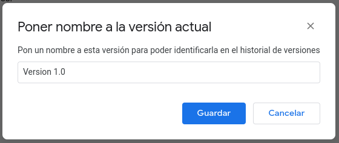

# ¿Qué es Git?

Cuando normalmente trabajamos en proyectos, estos duran una cierta cantidad de tiempo, bien pueden ser días, meses o años. Durante este tiempo, nuestro proyecto puede ser alterado un millar de veces y en caso de querer volver a ver una versión de hace 5 meses, si lo hemos alterado 100 veces durante ese periodo se nos hará extremadamente difícil poder ver lo que había.

Bien es cierto que cuando realizamos proyectos, siempre podemos hacer de manera manual una copia de cada versión justo antes de modificarla, es decir si yo creo una página web con una imagen y tengo pensado quitarla, crearía una versión con la página web que tiene una imagen y otra versión con la página web (llamada igual pero con v2 en el nombre por ejemplo) pero sin la imagen añadida. Esto evidentemente las primeras 2 - 3 veces puede servir, pero como nos ocurra 100 será humanamente imposible saber cual es el archivo que queremos enviar, por suerte existen aplicaciones denominadas “Aplicaciones de Gestión de Versiones” o en ingles “Version Control System” que nos ayudan en gestionar todas las actualizaciones que nosotros hagamos a nuestros proyectos.

Una de estas aplicaciones es Git, una aplicación creada por Linus Trovalds (el mismo creador del S.O Linux), con la finalidad de que fuera una forma eficiente, confiable y compatible del mantenimiento de las versiones de aplicaciones, sobre todo cuando estas tienen un gran número de archivos a los que hacer una gestión metódica y procedimental.

#

#### Vale, pero... ¿qué es git?

#

Claro, la teoría siempre queda muy bien, pero ¿qué es realmente?. Vamos a utilizar un ejemplo sencillo, pero en lugar de ser con un ejemplo de código vamos a hacerlo con algo más simple: un documento de texto de Google Docs.

He creado un documento con Google Docs, en el que he añadido un contenido simple para poder hacer la primera versión:

Como se puede ver en la imagen, Google Docs posee en todos los archivos de texto una pestaña llamada “Historial de versiones”. pasamos el ratón por encima nos saldrá lo siguiente:

Esto es lo que hace cada una:

- **Poner nombre a la <u>versión actual</u> del documento:** Este nombre puede ser el que nosotros queramos; siempre es recomendable que sea un nombre relevante ya que se referirá a la **versión actual** del documento:

- **Ver historial de versiones:** Aquí vemos todas las versiones que hemos ido creando (de manera involuntaria) cada vez que modificamos en el documento. 

Esto hasta donde yo conozco no sé si se pueden forzar, cada versión se crea cuando se guarda el documento de google, por lo que sí se puede guardar de manera manual se creará una versión nueva en el historial (repito que esto lo comento a modo de intuición, no estoy seguro).

Esta opción está en todos los documentos de Google, no hace falta habilitarla, pero si se necesitan permisos para ver dicho historial. Ahora vamos a crear una nueva versión, voy a añadir una imagen y ponerle a esta un pie de foto; veamos que pasa:

Antes de ver el historial guardamos el nuevo nombre de la versión actual.

En mi caso asigné el nombre antes de sacar la captura, de ahí que se muestre el mensaje de que “ya tiene un título”.

Ahora, si nos dirigimos al historial de versiones podremos ver lo siguiente:

Como podemos ver, la versión que aparece es la última que hemos realizado (es decir la que teníamos hasta hace nada en pantalla en el documento en cuestión). Y a la derecha podemos ver las versiones que han sido creadas:

La Versión que mostramos es la 2.0 pero ¿y si queremos ver la anterior?, pues sencillamente le damos encima del nombre (si le damos al desplegable nos deja ver los cambios en mayor profundidad).

También si nos fijamos hay una versión que no tiene un nombre, si no la fecha en la que fue creado el documento, esta es creada por defecto pero también puede asignársele un nombre según creamos el documento, lo cual no recomiendo, ya que así es más sencillo saber cuando se comenzó el documento y a su vez para poder distinguir las versiones.

Esto que hemos visto es cómo funcionan las aplicaciones de gestión de versiones habituales, y si os habéis fijado, google también tiene una especie de mini aplicación de control de versiones para sus documentos, no podría llegar a considerarse un VCS pero no se queda lejos. 

#

Existen dos tipos de estas aplicaciones: las distribuidas y las centralizadas (git es distribuida por ejemplo) pero en esto no quiero entrar en detalle ya que puede llegar a ser confuso, pero no está demás que sepamos que existen.

[Siguiente punto :arrow_forward:](1%20-%20Instalando%20Git.md)