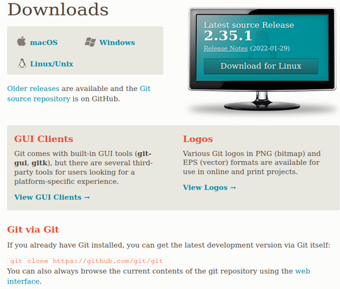

# Instalando Git

Dependiendo del sistema operativo la instalación será de una forma u otra, como siempre. La Web de instalación será la misma para todos los sistemas operativos, pero bien es cierto que hay ciertas cosas que deberemos tener en cuenta. La web de instalación es la siguiente: 

[https://git-scm.com/downloads](https://git-scm.com/downloads "Página de descarga oficial")

**¡OJO!** Git no es lo mismo que *GitHub* o *GitLab*, estos dos últimos son sitios webs y son conocidas como “forjas”, que vendrían a ser lugares en los que alojar proyectos, repositorios, etc; ya llegaremos al punto en el que utilizaremos ambos sitios para alojar nuestros trabajos en estos lugares.

Para Linux no haría falta descargar el paquete desde la página anterior, se darán las alternativas en su correspondiente apartado.

A continuación, proporciono un Indice en el que tendreis todas las formas de instalación posibles:

- [En Windows](Instalaciones/1.1%20Git%20en%20Windows.md).
- [En Linux](Instalaciones/1.2%20Git%20en%20Linux.md).
- En Mac.

[:arrow_backward: Anterior punto](0%20-%20Que%20es%20Git.md) 
[Siguiente punto :arrow_forward:](2%20-%20Primeros%20pasos%20con%20Git.md)