## Vamos a mancharnos un poco las manos.
#
###### Creación del primer repositorio.

Tras mucha teoría creo que ya es hora de que nos ensuciemos las manos un poco, ya que la mejor forma de hacer que algo se entienda es con ejemplos prácticos (no solo ejemplos visuales).

En primer lugar lo que deberemos hacer es irnos al terminal bash de nuestra máquina. Tanto en Linux como en Mac son la misma terminal, donde cambia es en Windows ya que lo hemos añadido con la instalación de Git (Consultar instalación de git).

Una vez estemos en este terminal, en caso de estar en una máquina Windows esta interfaz no es como el cmd, si no que en su lugar es una terminal Unix (la que tenemos en las máquinas Linux y Mac), un poco más fea he de decir, pero bastante buena. En caso de que queramos una terminal en condiciones, desinstalar Windows. Es broma, podemos utilizar una capa de compatibilidad llamada WSL (Windows Subsystem for Linux), que está en modo de desarrollo pero es utilizable. Hablaré de este tema en otro apartado, pero podéis mirar el siguiente enlace para poder informaros:

WSL (*Ingles*): https://www.computerhope.com/jargon/w/wsl.htm

Lo primero que tenemos que hacer es crear (o dirigirnos) a la carpeta en la que tengamos alojado nuestro proyecto, en mi caso la carpeta que contiene el proyecto se encuentra en mi carpeta ProyectoPrueba que a su vez está dentro de mi carpeta personal de Documentos. 

Dentro de esta carpeta deberemos seguir una serie de pasos para hacer que esta carpeta deje de ser una carpeta común y se convierta en un “repositorio” es decir, seguirá siendo una carpeta en la que se pueden almacenar todos los elementos que formen parte del proyecto pero ahora será utilizable con git.

En primer lugar deberemos estar dentro de la carpeta en la que almacenaremos todos los elementos de nuestro proyecto, para ello usaremos el comando cd para movernos entre carpetas. Una vez dentro de donde queremos crear nuestro repositorio podremos ver (con el comando ls con extensión -l ) que la carpeta está completamente vacía.

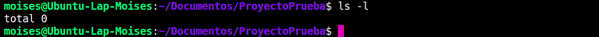

Para hacer ahora que esta carpeta sea un repositorio utilizaremos el comando **git**. La primera instrucción que vamos a ver es git init, la cual hace que nuestro directorio actual sea un repositorio. Nos devolverá un mensaje como el siguiente:

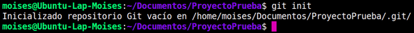

Pero no solo esto, ya que si volvemos a usar el comando ls, pero con la extensión -a veremos que se ha creado la carpeta .git (que es una carpeta oculta, por eso debemos usar la extensión -a) en Windows no se genera con el punto delante (creo).

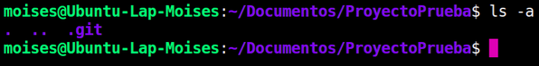

Ya tenemos el repositorio creado, pero de momento no hace nada. Ahora vamos a hacer una tarea sencilla, vamos a crear una Página Web que muestre la fecha, hora y día actual, bastante fácil ¿no?.

#
###### Gestion de repositorios.

Como bien hemos visto, para hacer que una carpeta se convierta en un repositorio deberemos utilizar el comando git init, esto lo que hará es generarnos una carpeta oculta llamada git (.git en Linux y Mac) lo cual hará que todo el contenido que se encuentra dentro de la carpeta (desde la que hayamos introducido el comando) sea controlado por git cuando nosotros se lo indiquemos, ya que podemos hacer que algunas cosas sean gestionadas y otras no.

Una vez lo hayamos creado abriremos la aplicación con nuestro IDE, en mi caso usaré el Visual Studio Code (pese a no ser un IDE), en caso de tener WebStorm adelante. Con dicho IDE abriremos la carpeta en la que hayamos inicializado el repositorio y nos quedaremos aquí ya que hay una serie de cosas que tenemos que tener en cuenta y preparadas antes de continuar.

***NOTA PARA LOS USUARIOS CON WINDOWS:***

Como bien se comentó en el anterior capítulo, deberemos utilizar una consola bash para poder realizar todo esto de una forma mucho más cómoda, debido a que cierto sistema operativo (Windows) requiere de una complejidad cognitiva mayor para realizar y entender instrucciones que se realizan por igual en Linux y Mac, y esto evidentemente limita bastante. 

Es por esto que en una máquina Windows, usamos un terminal dentro del IDE nos abrirá por defecto un CMD, y no es lo que queremos evidentemente así que tenemos que configurar en Visual Studio Code este parámetro (esto sólo lo harán los usuarios con un S.O Windows).

Dicho parámetro (al menos en Visual Studio Code) es accesible dirigiéndonos a las configuración en Archivo (File) > Preferencias (Preferences) > Configuración (Configuration).

Una vez aquí podemos buscar la pestaña terminal que suele estar en Características > Terminal o bien podemos escribirlo en la parte superior para encontrarlo antes:

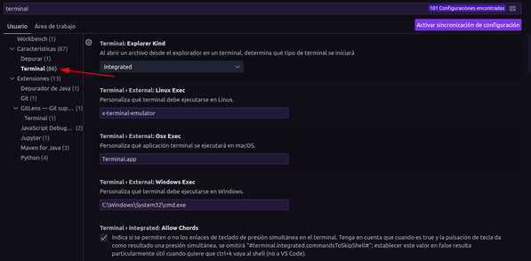

Una vez estemos aquí, donde vemos “Windows Exec” deberemos seleccionar la ruta en la que se encuentra el terminal que instalamos con Git previamente (suele estar dentro de la carpeta personal del usuario en el que hayamos logueado: C:\Program Files\Git\bin\bash.exe). Esto se puede hacer de igual manera en otros IDE como IntelliJ IDEA o PyCharm

Esta ruta podría cambiar e incluso podría depender de la que nosotros seleccionaremos previamente en el proceso de instalación de Git, pero lo que se deberá buscar es el archivo ejecutable del terminal bash.

Para el resto de usuarios (Linux y Mac) no hay mucho que decir sobre este aspecto, debido a que ya tenéis un terminal idóneo para esta actividad.

Bien, vamos a empezar:

Entramos en el Visual Studio Code / IntelliJ IDEA / WebStorm / Cualquier IDE - Editor de Código decente. Y se nos dará la posibilidad de abrir una carpeta, en este caso abriremos la carpeta en la que hayamos creado el **.git**, (no abriremos la carpeta **.git**, si no donde se encuentra esta). Una vez dentro, crearemos un archivo **index.html** para la página web en cuestión, además de una carpeta **app** o **js** para el archivo *.js* y una carpeta css para las hojas de estilo.

Si nos fijamos, nos aparecerán los nombres de los archivos y carpetas con colores, además de unas letras al lado de nuestros elementos:

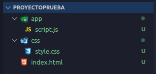

Esto sucede porque Visual (además de los editores de JetBrains) trabajan con Git y son compatibles con este, y eso mola. Es como un crossover de los Avengers.

Ahora introduciremos la estructura base de la Página Web (es decir en el archivo index), para ello hay un snippet (ya hablaré de qué son y cómo se crean) que nos permite crear la estructura de html del tirón (esto al menos en Visual Studio Code).

El snippet es “!” (Sin las comillas)

Cuando lo escribimos nos sale una abreviación de lo que tiene dentro:

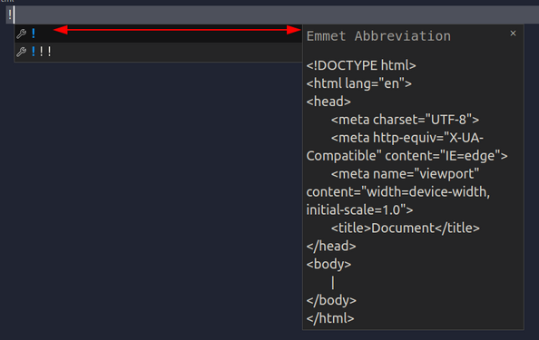

Nos debería de dejar una estructura como esta (sin las tabulaciones y espacios que los he añadido yo por cuenta propia).

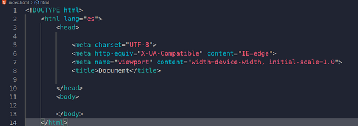

Una vez hecho esto ya tenemos la primera versión del documento, pero aún no está sentenciada, es decir, es una versión pero no se lo hemos dicho a git todavía.

Una de las cosas buenas que tiene git es la monitorización, lo que vendría a ser que cada elemento, acción o versión que creemos se podrá ver con alguna de sus instrucciones. En este caso la instrucción a la que me refiero es **git status**. Y si, comprueba el estado del repositorio actual, como se puede ver los comandos son un tanto intuitivos por su nombre.

Si lo ejecutamos, podemos ver que nos mostrará algo como lo siguiente:

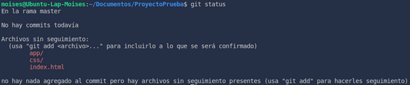

Ignoraremos las dos primeras frases que hay y nos centraremos en el bloque que dice “Archivos sin seguimiento: […]”

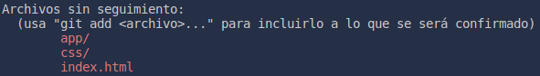

Esto vendría a venir a decirnos que los archivos que se nos muestran no existen como tal en el repositorio. ¿Pero están ahí no?, osea si, pero lo que ocurre es que no los hemos asignado para que git tenga un seguimiento de ellos y por lo tanto que pueda crear versiones de dichos archivos, según los hemos ido guardando y posteriormente modificando.

Si recordamos lo que ocurría en Google Docs, cuando nosotros modificamos el documento, de manera automática se creaba una versión a la que nosotros ponemos el nombre que queríamos **cada vez que el documento se guardaba**; pues en git es igual, solo que tenemos que primero añadir el elemento al que queremos que se le vayan añadiendo las versiones y lo guardaremos cuando veamos conveniente.

De momento queremos que todos los elementos que aparecen en rojo se añadan para que tengan un seguimiento, para ello tenemos que saber cual es el comando a utilizar:

Para añadir y decirle a git que elementos queremos que tenga en seguimiento usaremos la instrucción **git add + elemento** que queramos añadir.

> En lugar de escribir git add 3 veces para añadir todo, existe la opción "*git add .*" ; que añade todos los elementos que nos salgan para añadir, es decir los que tenemos en color rojo cuando hacemos un "*git st   atus*".

Cuando introducimos la instrucción y volvemos a escribir **git status** nos aparecerá de la siguiente manera:

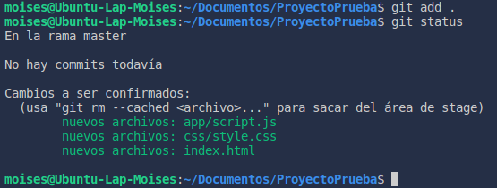

Ahora ya tenemos nuestros archivos añadidos, si por ejemplo me he equivocado y he añadido un archivo de los ya añadidos (no puede ser uno no añadido) podemos introducir la instrucción: 

    git rm --cached + Archivo

**IMPORTANTE:** Es muy importante añadir la opción cached, ya que si lo hacemos a secas, es decir escribiendo git rm seguido del nombre del archivo, lo que hará es borrar el archivo del disco directamente. 

Si como bien comentaba, queremos quitar por ejemplo el archivo index.html de los que he añadido, tendríamos que poner **git rm --cached index.html** haciendo que si volvemos a añadir un git status se nos vea así:

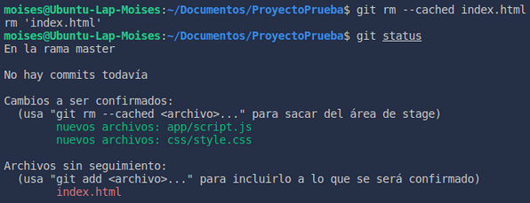

Ahora volvemos a añadir el archivo index utilizando la instrucción ya vista de git add.

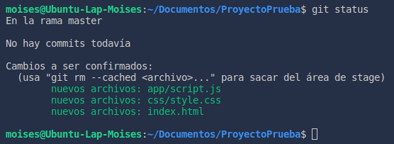

Ahora, debemos aplicar dichos cambios, y no me refiero a guardarlos sino a confirmarlos. Cuando trabajamos en git, el hecho de guardar un archivo no es suficiente como para que se guarden correctamente y así crear el histórico en el que se ve el progreso de lo que hemos ido haciendo a lo largo del repositorio.

Para hacer esto deberemos utilizar el comando **git commit** seguido de algunas opciones que comentaré en un momento.

Con este comando “sellamos” un llamado commit del repositorio, ya que no llegaría a considerarse una versión como tal, a este concepto llegaremos más adelante. 

Utilizando el comando **git commit** sin ninguna extensión hará que se nos abra el editor que tengamos por defecto. En el caso de los usuarios de Windows será aquel que seleccionamos en el proceso de instalación (si no lo hemos modificado con anterioridad).

Nos aparecerá un mensaje como el siguiente:

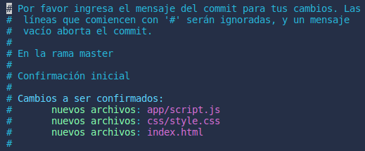

Lo que deberemos hacer es escribir el mensaje (bien antes o después del comentario; ó también lo podemos borrar pero no lo recomiendo). Debería de quedarnos como en la siguiente captura:

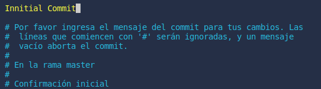

De momento, el mensaje podrá ser el que queramos, ya veremos que existe una serie de pautas y reglas que deberemos seguir para poder tener una estructura de commits perfecta.

Para salir en caso de ser vim es mediante la instrucción ( **: + w + q** ) o ( **: + x** ) sin el símbolo “**+**”, ni los paréntesis:

Y en caso de querer salir si no queríamos hacer ningún commit y nos hemos equivocado por alguna razón será mediante la instrucción 
( **: +  q + !** ) sin el símbolo “**+**”, ni los paréntesis.

Una vez lo hayamos guardado, podremos ver que se nos han añadido unas líneas a la terminal:

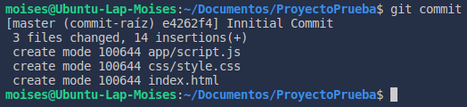

Pero ¿cómo lo vemos ahora que lo hemos guardado? ya que de primeras no ha pasado nada, no es algo perceptible como lo puede ser borrar, editar o guardar un fichero de una manera tradicional. Pues no worries, para esto utilizaremos el comando **git log**. 

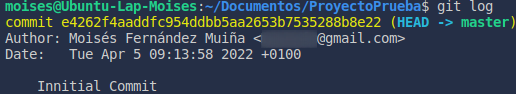

También tenemos la posibilidad de utilizar la extensión --oneline para poder ver todos los commit de una forma más resumida y compacta, pero de momento al tener uno solo poco nos importa.

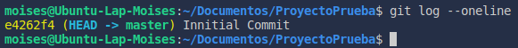

Y con esto ya sabremos como suele ser el protocolo de git a la hora de crear estas *timestamps*  ó *marcas de tiempo* (por ponerle un nombre).

Ahora imaginemos la siguiente situación: supongamos que yo, con el repositorio como lo teníamos con anterioridad, realizo una modificación importante por la cual necesitaría realizar un *commit* para poder tener una marca de tiempo a dicho momento (como bien hicimos con el caso anterior):

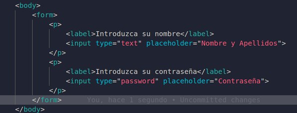

Digamos que realicé los anteriores cambios y realice dicho commit; y por cualquier razón quiero volver al primer commit que hice, justo en el que tenía la página vacía, ya que quiero ver como estaba en ese punto (el que usamos para el ejemplo vamos).

Como se puede ver a continuación tenemos los dos commits que hemos realizado, al que queremos ir es al marcado (el comando introducido para el commit lo explicaré con más detalle a continuación):

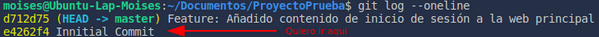

Pero claro, me olvidé cómo estaba la estructura al inicio de todo, y quiero volver para ver como era en su momento, ¿como lo hago?. Pues es sencillo, lo único que deberemos tener en cuenta es que de momento no podremos modificar algo en caso de quererlo (para cuando nos cambiemos a dicha rama).

Es decir, si al volver atrás vemos que hay una palabra sin tilde y modificamos el documento para correguirlo no podremos ya que hay un procedimiento previo para realizarlo.

De momento lo que nos interesa solo es volver a dicho punto, para más que sea ver lo que había. Para ello usaremos la instrucción git checkout seguida del commit al que queremos ir, es decir la versión a la que queremos cambiarnos para ver su contenido (la parte amarilla de la imagen). Tras introducirlo y confirmarlo nos aparecerá un mensaje como el siguiente:

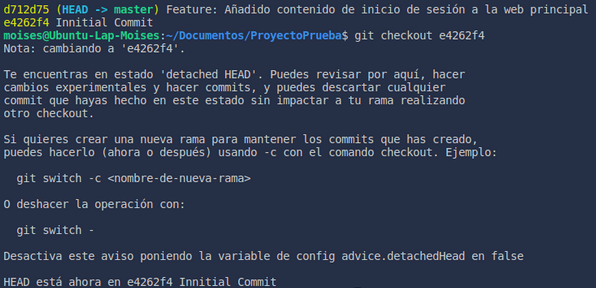

Esto ahora parece mucha información, pero veremos que dentro de un momento lo reconoceremos como al agua. Lo que nos intenta decir el comando para que nos hagamos una idea, es que nos hemos cambiado de commit pero en un estado que está separado del commit principal, al que se denomina como cabecera o HEAD en git; es por esto que no podemos realizar los cambios, ya que esto es solo posible en el HEAD al menos de momento. 

Nos intenta decir que si queremos guardar los cambios podemos crear una rama o branch, que normalmente se reconoce más como este último; esto lo veremos más adelante.

De momento toda esta información la ignoraremos completamente y haremos caso a la última línea, que nos dice: 

> **HEAD está ahora en e4262f4 Mensaje**

Sencillamente nos notifica que nos hemos cambiado correctamente.
Ahora si nos fijamos, el documento ha cambiado; ya no tiene el contenido que habíamos introducido, y ya no solo este, cualquier cambio que nosotros hubiésemos tenido respecto al momento actual habría sido visible ya que son dos commits distintos, es decir, dos marcas de tiempo diferentes.

[:arrow_backward: Anterior punto](1%20-%20Instalando%20Git.md) 