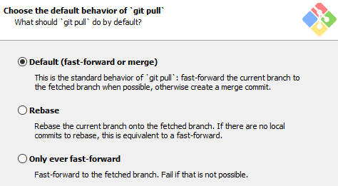
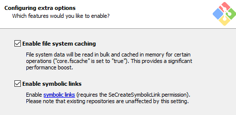

### En Windows 10

Como en toda máquina Windows, la instalación de Git no es cosa de otro planeta, y no requiere más que la capacidad de tener una mínima comprensión lectora de lo que se nos intenta instalar en cada paso, por ello se realizará una instalación de ejemplo (en la versión 2.35.1.2, que es en la que se está realizando esta documentación) para ver cuales son las opciones que nos salen.

En primer lugar y probablemente el más importante es que debemos dirigirnos a la web oficial desde donde descargaremos Git. Ahora empecemos con el proceso de instalación.

Como siempre según iniciamos una instalación nos aparecerá la licencia y los términos de uso, en este caso se trata de una licencia GNU (de uso público).

Posteriormente nos aparecerá la ruta en la que queremos instalar nuestro Git, lo cual es importante aunque no lo parezca, ya que algunas herramientas que nosotros utilizaremos se encontrarán en dicha ruta, pero con sencillamente memorizar donde se encuentra es suficiente.

Tras de esto nos saldrá una especie de checklist de utilidades que queramos añadir junto a git, las que vienen por defecto son las que necesitaremos, pero si queremos podemos añadir las dos ultimas ya que son bastante útiles.

**IMPORTANTE:** Este paso es probablemente el más importante de todos así que antes de avanzar asegúrate de que tengas seleccionadas estas opciones, ya que nos serán muy útiles para entender los apartados siguientes y te resultará más sencillo a la hora de trabajar en otros SOs.

Tras la checklist de componentes nos aparecerá la sección en la que añadimos si queremos o no añadir un shortcut al menú principal, esto básicamente vendría a ser lo que nosotros utilizamos en Windows para seleccionar en la barra de búsqueda la aplicación que queremos buscar valga la redundancia, recomiendo añadir esta opción.

Tras crear dicho shortcut podremos optar a seleccionar el editor por defecto que tendrá nuestro Git, y aquí ya será en cuestión tuya el elegir qué editor quieres o no usar. Por recomendación puedo decir que si eres un usuario nuevo en este sector y no has trabajado nunca con una máquina Linux que utilices nano, ya que es un editor bastante sencillo de utilizar para una terminal y no suele costar; en caso de que ya seas un usuario más experimentado creo que no hará falta recomendación alguna pero utilizar vim no es una mala decisión. 

Si nos gusta algún otro editor que no sea de terminal, el propio git nos ofrece unos cuantos entre los que se encuentran algunos que ya podríamos tener instalados y otros que nos instalará si los marcamos, lo cual en caso de querer podemos marcar sin problema pero repito que mi recomendación es acostumbrarse a ***nano*** o en su defecto a ***vim***.

Estos son algunos de las alternativas que se nos ofrecen:

- Notepad ++.
- Visual Studio Code.
- Visual Studio Code Insiders.
- Sublime Text.
- Atom.
- VSCodium.
- Notepad.
- Wordpad.

Y en caso de no querer ninguno de los anteriores (que ya te valdría) podremos seleccionar uno que nosotros tengamos y no aparezca en la lista.

Tras la dura selección del editor de Git, se nos dará otra opción (que es nueva en cuanto a este tipo de aplicaciones) y es la elección entre el nombramiento clásico o el nombramiento actual y pese a que pueda parecer una tontería a mi me parece un gran añadido.

Esta opción sencillamente hará que cada vez que nosotros creemos un repositorio, la rama principal (que ya llegaremos a explicar lo que son) se nos pondrá con el nombre main o master, según que opción hayamos escogido. Pero ya no solo eso, si no que en caso de no querer que se llame de alguna de estas dos podemos hacer que se llame de la manera que nosotros deseemos; bien es cierto que esto se aplicará para la rama principal, de todos los proyectos que creemos por lo que elegir bien el nombre, pero se puede modificar no os preocupeis.

En mi caso, por seguir un poco la tradición actual he elegido la opción de llamarla main, ya que master se ha quedado obsoleto con el paso del tiempo.

La siguiente opción es la de la utilización de las variables de entorno que añade la aplicación y esto es que a la hora de instalar la aplicación, se nos añadirán unas variables de entorno que utiliza Git en la consola para que los usuarios puedan crear, modificar, añadir elementos, … a los repositorios, y para esto nos dan tres opciones (en realidad para nosotros nos influyen dos pero explicaré las tres).

- La **primera opción** nos añade las variables de entorno únicamente a la terminal bash, es decir que si nosotros fuéramos al cmd de windows no podríamos usar Git, por lo que las variables de entorno no serían modificadas.
- La **segunda opción** añade sólo los elementos básicos (más bien wrappers que vendrían a ser subrutinas) que nos permitirían el uso de Git en tanto el cmd de Windows como en la PowerShell; pero ya no solo esto, si no que cualquier programa externo, es decir uno de terceros también podrá acceder a dichas variables. 
- Y por último, pero no menos importante la **última opción** sobreescribirá algunas variables de entorno existentes en el cmd de Windows (como los ejemplos “find” y “sort”). Y nos avisa que únicamente seleccionemos esta en caso de que sepamos 100% las implicaciones que supone.

Deberemos seleccionar la segunda opción, ya que seleccionar la tercera no solo nos limitaría a utilizar solo el bash, si no que no podríamos utilizar git con otras aplicaciones como git desktop (que es una forma de utilizar git de forma gráfica).

Tras esto se nos pedirán algunas opciones que deberemos dejar tal y como se dejan en las imágenes, ya que son temas que no toca explicar aquí y no es plan tampoco de instalar aplicaciones o elementos externos solo para instalar y dejar configurado git.

La siguiente opción es la de utilizar un emulador de terminal o el propio cmd, recomiendo utilizar un emulador, porque recurrir al cmd para ambas cosas es un tanto enrevesado, y de esta forma nos sería más fácil distinguir cuando estamos en Bash o en el cmd normal de Windows. El emulador se llama MinTTY.

Tras esto, seguimos como con el procedimiento anterior marcando las opciones de las capturas.

Las siguientes dos opciones son una novedad añadida recientemente y no hace falta que sean marcadas asi que no hace falta que lo hagáis.

Y este sería nuestro último paso, para saber ahora si tenemos git instalado sencillamente iremos a Programas y características y buscaremos Git:

